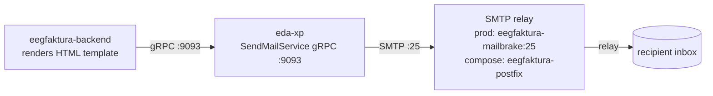

# Notification e-mail flow

How member- and admin-facing notification e-mails (for example metering-point
**activation** and **completion**) are rendered and delivered.

!!! note "Not the same as EDA-over-e-mail"
    This flow is **separate** from `eda-xp`'s EDA-over-e-mail transport (PONTON-MAIL) used for
    market messages. `eda-xp` happens to host both, but they are different code paths — see
    [Messaging](messaging.md) and [services/eda-xp](../services/eda-xp.md).

## Chain

1. **Render** — the backend fills an HTML template with the EEG / participant / metering-point
   data. Templates live at `/opt/storage/public/<tenant>/templates/` with a global fallback
   `/opt/storage/public/templates/`.
2. **gRPC hand-off** — the backend has **no direct SMTP path**. It calls the `SendMailService`
   (proto package `at.energydash`) at `services.mail-server`
   (`VFEEG_BACKEND_SERVICES_MAIL_SERVER`), which in the cluster resolves to
   `eegfaktura-xp-adapter-grpc:9093`. The gRPC `Sender` field carries only the **tenant id**,
   not an e-mail address.
3. **SMTP relay** — `eda-xp` relays the message via SMTP to the mail relay:
   **`eegfaktura-mailbrake`** (Postfix) in production, `eegfaktura-postfix` in the
   docker-compose stack.
4. **Delivery** — sent as `From: no-reply@eegfaktura.at`, `Cc:` the EEG's own office address
   (`eeg.Email`), `To:` the member.

## Who sends what

| Sender | Path | Examples |
|---|---|---|
| **eegfaktura-backend** | renders a Go `html/template` → gRPC `SendMailService` → relay | metering-point **activation** ("Aktivierung im Serviceportal"), **completion** ("Dein Zählpunkt ist aktiv") |
| billing | renders a **FreeMarker** template → its **own** `JavaMailSender`/SMTP (`MAIL_*` env) → relay | run-completion, billing documents |
| keycloak | its own SMTP → relay | password reset, e-mail verification |

Only the backend uses the gRPC hop through `eda-xp`; billing and keycloak talk SMTP to the
relay directly. Note the template engines differ per sender: the backend uses Go
`html/template` (see [Templates & conventions](#templates-conventions) below), while billing
renders with **FreeMarker** (`BillingEmailDefaultTemplate.ftl`, `MAIL_NO_REPLY_TO` sender,
`Cc:` the issuer). Any per-tenant mail-text editing therefore has to be designed per path — the
two do not share a template store.

## Recipient address handling

All senders share **one address rule** (implemented per language, not via a shared library):
after trimming outer unicode whitespace — including the non-breaking spaces `U+00A0` / `U+202F`
/ `U+2007` — per `;`-separated part, a valid address is `local@domain.tld` with an ASCII local
part (`[a-zA-Z0-9._%+-]`), a TLD of at least two letters, and **no** TLD allowlist. A value that
is empty after trimming means "no e-mail" — not an error, no send. Canonical stored form:
`;`-joined without spaces.

- **Write paths (backend, server-side — not only the web form):** the rule is enforced on every
  path that persists a member or EEG e-mail — participant create / update / partial-update
  (`contact.email`), the EEG office address (`eeg.Email`), and the Excel master-data import.
  Invalid addresses are rejected (API) or imported without e-mail plus an import-log entry
  (Excel); a value that trims to empty is stored as `NULL` so the send-path `Valid` guard stays
  meaningful.
- **Send paths:** both backend senders (`SendMail`, `SendMailWithAttachment`) normalise `to`/`cc`
  and send the **normalised** value. `eda-xp` splits on `;`, delivers to the valid recipients,
  and returns the refused ones in the additive proto field `SendMailReply.rejectedRecipients`
  (backward compatible) so the backend can raise an admin notification instead of dropping them
  silently; an address list with no valid recipient fails the request. billing normalises and
  validates before building the `MimeMessage` — a rejected part on an **otherwise delivered**
  mail (e.g. an invalid office `Cc:`) is a *warning* in the run protocol, **not** a `FEHLER`
  (a delivered invoice must not trigger a manual re-send → duplicate invoices).
- **Admin visibility:** failed sends surface through the existing `N_TYPE_ERROR` notification
  system (web `/page/notifications`); the member detail pane shows an **"E-Mail ungültig"** badge
  for stored addresses that fail the rule, so tenant admins can spot and correct them.

## Templates & conventions

- Per-tenant templates under `/opt/storage/public/<tenant>/templates/`; if a **specific file**
  is missing (not just the whole directory), the backend falls back to the global
  `/opt/storage/public/templates/`.
- Member-facing mails use the informal **"du"** salutation.
- Shared signature / footer: EEG description → address → phone / e-mail / website (each behind a
  `Valid` guard) → "versandt durch" → logo capped at `max-height: 90px`.
- `null.String` template fields must be rendered via `.String` with a `Valid` guard — printing
  the value directly emits the raw struct (`{{value true}}`).

## Related

- [services/backend](../services/backend.md) — renders and dispatches member notifications
- [services/eda-xp](../services/eda-xp.md) — hosts the `SendMailService` gRPC endpoint
- [services/mailpit](../services/mailpit.md) — the SMTP relay component
