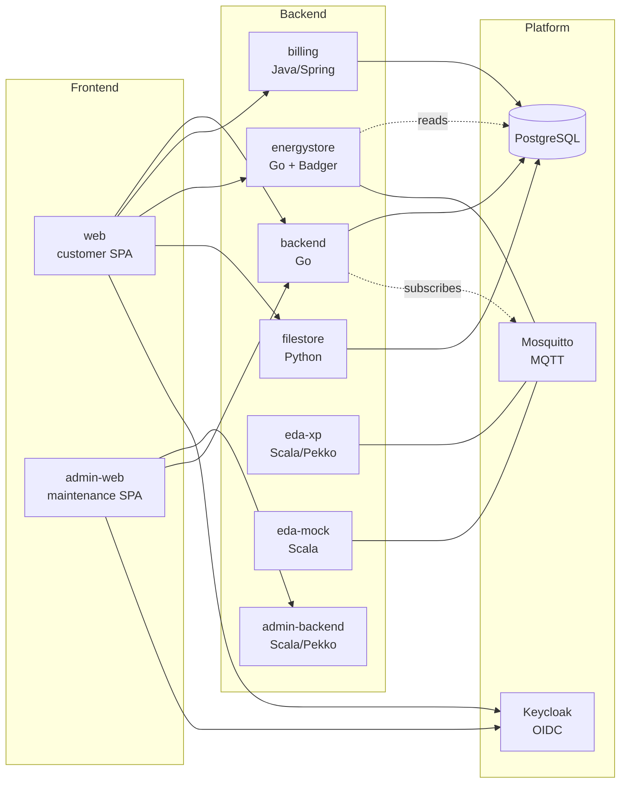

# Service Overview

The eegfaktura platform is a microservice stack that manages member master data, ingests energy data from Austrian network operators, allocates that energy to community members by a per-period participation factor, and produces the resulting billing documents.

## Service topology

## Service tiers

The 14 services in a typical instance group into three tiers.

### Backend layer — domain APIs

Each backend owns a slice of domain logic and exposes a REST API consumed by the frontends.

| Service | Language | Owns | Detail |
|---------|----------|------|--------|
| **backend** | Go | Master data: participants, metering points (Zählpunkte), EEGs, contracts, tariffs | [services/backend.md](../services/backend.md) |
| **billing** | Java / Spring | Billing document generation, tariff application, billing-run state | [services/billing.md](../services/billing.md) |
| **energystore** | Go + Badger | Energy time-series storage and per-period reports | [services/energystore.md](../services/energystore.md) |
| **filestore** | Python | Document storage and download endpoints | [services/filestore.md](../services/filestore.md) |
| **eda-xp** | Scala / Pekko | EDA protocol gateway (network operator communication) | [services/eda-xp.md](../services/eda-xp.md) |
| **eda-mock** | Scala | EDA stub for environments without a real network-operator link | [services/eda-mock.md](../services/eda-mock.md) |
| **admin-backend** | Scala / Pekko | VFEEG-superuser maintenance API | [services/admin-backend.md](../services/admin-backend.md) |

### Frontend layer — SPAs

Single-page applications served by Caddy. Both authenticate against the same Keycloak realm but talk to different backends.

| Service | Audience | Detail |
|---------|----------|--------|
| **web** | Community members and EEG admins | [services/web.md](../services/web.md) |
| **admin-web** | VFEEG maintenance operators (cross-instance) | [services/admin-web.md](../services/admin-web.md) |

### Platform layer — infrastructure

Stateful dependencies, deployed alongside the application services.

| Service | Role | Detail |
|---------|------|--------|
| **keycloak** | OIDC identity provider, single realm `EEGFaktura` | [services/keycloak.md](../services/keycloak.md) |
| **postgres** | Relational database; one logical DB, multiple schemas | [services/postgres.md](../services/postgres.md) |
| **mosquitto** | MQTT broker for EDA inbound messages and energy data | [services/mosquitto.md](../services/mosquitto.md) |
| **mailpit** | SMTP catcher for non-production environments | [services/mailpit.md](../services/mailpit.md) |
| **billing-cert-rotator** | Refetches Keycloak's JWT signing cert for billing | [services/billing-cert-rotator.md](../services/billing-cert-rotator.md) |

## Request flow examples

### Member views their dashboard

1. **web** loads the SPA from Caddy, redirects to Keycloak for OIDC login.
2. Keycloak issues a JWT with `tenant`, `access_groups`, `email` claims.
3. SPA calls **backend** for master data (participant, EEG settings).
4. SPA calls **energystore** with `X-Tenant` header for the current period's energy report.
5. SPA calls **billing** for outstanding documents.
6. Each backend independently validates the JWT against Keycloak's JWKS, then enforces its own tenant / role check.

### Energy data arrives from a network operator

1. PONTON (external EDA adapter) POSTs an XML message to **eda-xp**.
2. eda-xp dispatches the XML to the matching scalaxb-generated handler by message code and version.
3. Handler enriches the message with stored conversation state from prior outbound requests.
4. eda-xp publishes the result to **mosquitto** under `eda/<tenant>/protocol/<process_lower>`.
5. **backend** subscribes to the relevant protocols and updates state in PostgreSQL.
6. For energy-data responses (`ENERGY_FILE_RESPONSE`), **energystore** consumes a separate MQTT topic and persists the time-series.

See [Messaging](messaging.md) for the full inbound pipeline.

### Admin runs the monthly billing

1. **admin-web** or **web** (with `EEG_ADMIN` group) calls **billing** to create a preview.
2. billing reads energy data from **energystore** and master data from **backend** (or the database directly, depending on the call).
3. billing computes `verbrauchertarif × G.03` and `erzeugertarif × (G.01T − P.01T)` per metering point.
4. Preview documents are stored, member-readable via **filestore**.
5. Admin triggers the **final billing** action; the run becomes immutable.

See [reference/obis-codes](../reference/obis-codes.md) for the energy-data semantics, and [services/billing](../services/billing.md) for the run state machine.

## Cross-cutting concerns

| Concern | Where it lives | Page |
|---------|----------------|------|
| Authentication | Keycloak realm + per-service JWT verification | [Authentication](auth.md) |
| Database access | One PostgreSQL cluster, schema per service | [Databases](databases.md) |
| Messaging | Mosquitto MQTT, EDA-inbound pipeline | [Messaging](messaging.md) |
| Deployment | Helm charts + Argo CD (services) + Helm-managed bootstrap chart (data) | [Deployment](deployment.md) |

## Source repositories

Each service is its own repository. The platform repository (Helm charts, Argo manifests, provisioning pipeline) is a separate repository and orchestrates the deployment of all of them.

Service-to-repository mapping is documented per service page under [Services](../services/).
