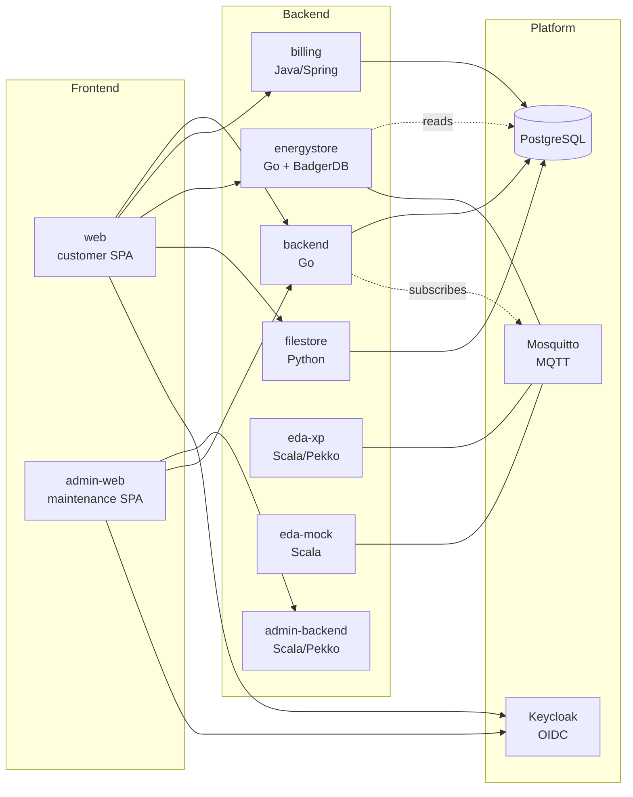

# Service Overview

The eegfaktura platform is a microservice stack that manages member master data, drives the EDA lifecycle of members and metering points (register, activate, deactivate, change participation factor), and ingests the per-period allocations computed by the Austrian network operator. The network operator owns the allocation math — eegfaktura stores the resulting values and uses them to produce billing documents.

## Service topology

## Service tiers

The local stack defines **13 services** (see `docker-compose.yaml`), grouped into three tiers below. The `eda-mock` stub is listed for completeness but is **not** part of the standard compose stack — the stack runs the real eda-xp connector (`eegfaktura-kep`).

### Backend layer — domain APIs

Each backend owns a slice of domain logic and exposes a REST API consumed by the frontends.

| Service | Language | Owns | Detail |
|---------|----------|------|--------|
| **backend** | Go | Master data: participants, metering points (Zählpunkte), EEGs, contracts, tariffs | [services/backend.md](../services/backend.md) |
| **billing** | Java / Spring | Billing document generation, tariff application, billing-run state | [services/billing.md](../services/billing.md) |
| **energystore** | Go + BadgerDB | Energy time-series storage and per-period reports | [services/energystore.md](../services/energystore.md) |
| **filestore** | Python | Document storage and download endpoints | [services/filestore.md](../services/filestore.md) |
| **eda-xp** | Scala / Pekko | EDA protocol gateway (network operator communication) | [services/eda-xp.md](../services/eda-xp.md) |
| **eda-mock** _(not in compose stack)_ | Scala | EDA stub for environments without a real network-operator link | [services/eda-mock.md](../services/eda-mock.md) |
| **admin-backend** | Scala / Pekko | VFEEG-superuser maintenance API | [services/admin-backend.md](../services/admin-backend.md) |

### Frontend layer — SPAs

Single-page applications served by Caddy. Both authenticate against the same Keycloak realm but talk to different backends.

| Service | Audience | Detail |
|---------|----------|--------|
| **web** | Community members and EEG admins | [services/web.md](../services/web.md) |
| **admin-web** | VFEEG maintenance operators (cross-instance) | [services/admin-web.md](../services/admin-web.md) |

### Platform layer — infrastructure

Stateful dependencies, deployed alongside the application services.

| Service | Role | Detail |
|---------|------|--------|
| **keycloak** | OIDC identity provider, single realm `EEGFaktura` | [services/keycloak.md](../services/keycloak.md) |
| **postgres** | Relational database (custom image); one `eegfaktura` DB with multiple schemas plus a separate `keycloak` DB | [services/postgres.md](../services/postgres.md) |
| **mosquitto** | MQTT broker for EDA inbound messages and energy data | [services/mosquitto.md](../services/mosquitto.md) |
| **postfix** | Mail relay (forwards to an external SMTP relay host) | [services/postfix.md](../services/postfix.md) |
| **proxy** | Caddy reverse proxy (host ports 8001 customer SPA / 8002 admin SPA) | [services/proxy.md](../services/proxy.md) |

!!! note "billing-cert-rotator is platform-only"
    The **billing-cert-rotator** (refetches Keycloak's JWT signing cert for billing) is a platform/Kubernetes-only component. It is **not** part of the local docker-compose stack and is not in the billing repo.

## Request flow examples

### Member views their dashboard

1. **web** loads the SPA from Caddy, redirects to Keycloak for OIDC login.
2. Keycloak issues a JWT with `tenant`, `access_groups`, `email` claims.
3. SPA calls **backend** for master data (participant, EEG settings).
4. SPA calls **energystore** with `X-Tenant` header for the current period's energy report.
5. SPA calls **billing** for outstanding documents.
6. Each backend independently validates the JWT against Keycloak's JWKS, then enforces its own tenant / role check.

### Energy data arrives from a network operator

1. PONTON (external EDA adapter) POSTs an XML message to **eda-xp**.
2. eda-xp dispatches the XML to the matching scalaxb-generated handler by message code and version.
3. Handler enriches the message with stored conversation state from prior outbound requests.
4. eda-xp publishes the result to **mosquitto** under `eda/<tenant>/protocol/<process_lower>`.
5. **backend** subscribes to the relevant protocols and updates state in PostgreSQL.
6. For energy-data responses (`ENERGY_FILE_RESPONSE`), **energystore** consumes a separate MQTT topic and persists the time-series.

See [Messaging](messaging.md) for the full inbound pipeline.

### Admin runs the period billing

The billing period is configurable per EEG — monthly, quarterly, biannual, or yearly (see `base.eeg.billing_period`). The same flow runs once per chosen period.

1. **admin-web** or **web** (with `EEG_ADMIN` group) calls **billing** to create a preview.
2. billing reads the network-operator-allocated values from **energystore** and master data from **backend** (or the database directly, depending on the call).
3. billing applies `verbrauchertarif × G.03` and `erzeugertarif × (G.01T − P.01T)` per metering point.
4. Preview documents are stored, member-readable via **filestore**.
5. Admin triggers the **final billing** action; the run becomes immutable.

See [reference/obis-codes](../reference/obis-codes.md) for the energy-data semantics, and [services/billing](../services/billing.md) for the run state machine.

### Member-/Zählpunkt-lifecycle operations

Most day-to-day admin work in the customer SPA triggers an EDA process against the network operator. These are asynchronous — the local state moves to an intermediate "requested" state immediately, and the final state is set when the operator's response arrives via the [inbound pipeline](messaging.md).

| UI action | EDA process | Effect |
|-----------|-------------|--------|
| Add member + Zählpunkt | (no EDA) | `base.participant` + `base.metering_point` row, status `NEW` |
| Activate Zählpunkt | `EC_REQ_ONL` | `NEW` → `ACTIVATED`; later `ACTIVE` on operator response |
| Deactivate Zählpunkt | `EC_REQ_OFF` | `ACTIVE` → inactive on operator response |
| Change participation factor | `EC_REQ_PRZ` | factor change takes effect on the next operator-confirmed day; allowed only Mon-Fri 09:00–17:00 |
| Request energy data | `EC_REQ_ENE` | operator delivers per-period values (G.01 / G.02 / G.03 etc.) via `ENERGY_FILE_RESPONSE` |
| Request participant list | `EC_REQ_LST` | reconciles the operator-side list of who is in this EEG |

Inbound (operator-initiated) flows include revocations (`CM_REV_SP`, `CM_REV_IMP`, `CM_REV_CUS`) which move a metering point to `REVOKED` without local action.

See [services/backend](../services/backend.md#eda-subscriptions) for the subscription-and-handler mapping.

## Cross-cutting concerns

| Concern | Where it lives | Page |
|---------|----------------|------|
| Authentication | Keycloak realm + per-service JWT verification | [Authentication](auth.md) |
| Database access | One PostgreSQL cluster, schema per service | [Databases](databases.md) |
| Messaging | Mosquitto MQTT, EDA-inbound pipeline | [Messaging](messaging.md) |
| Deployment | Helm charts + Argo CD (services) + Helm-managed bootstrap chart (data) | [Deployment](deployment.md) |

## Source repositories

Each service is its own repository. The platform repository (Helm charts, Argo manifests, provisioning pipeline) is a separate repository and orchestrates the deployment of all of them.

Service-to-repository mapping is documented per service page under [Services](../services/index.md).
